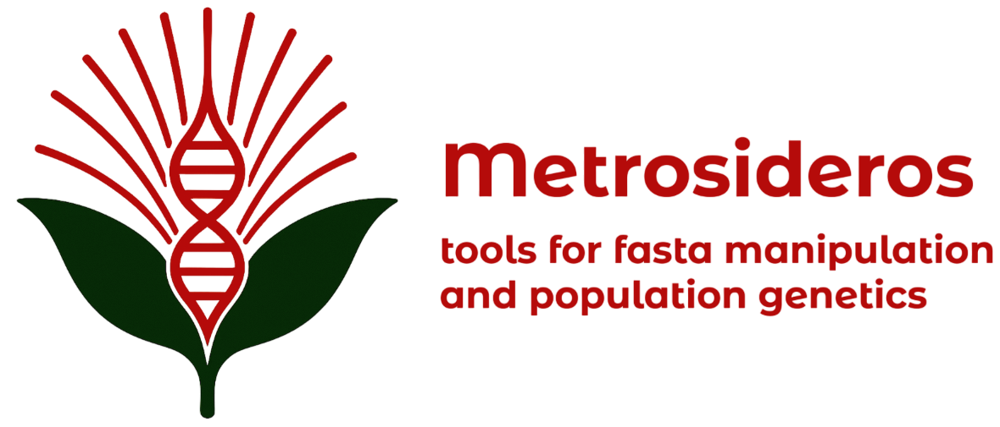

<p align="center">
  
</p>


# About
This repository stores custom Python scripts that I wrote for the main project of my MRes Computational Methods in Ecology and Evolution at Imperial College London. This work was completed during a nine-month research project in the group of Vincent Savolainen, investigating the sympatric speciation event of _Metrosideros sclerocarpa_ and _M. nervulosa_. The work has been published and is available at [Osborne, Owen G., Tane Kafle, Tom Brewer, Mariya P. Dobreva, Ian Hutton, and Vincent Savolainen. 2020. ‘Sympatric Speciation in Mountain Roses (Metrosideros) on an Oceanic Island’. Philosophical Transactions of the Royal Society B: Biological Sciences](https://doi.org/10.1098/rstb.2019.0542).


# Scripts
These scripts are made to be run from your command line. Running any of the scripts with the -h flag will give a detailed explanation on its usage. Below, I provide a brief description of each of the scripts in the `scripts` dir.

```bash
python3 calculate_fst.py -h # to get help for running a script.

# example usage of the script calculate_fst.py
python3 calculate_fst.py -i myvcf.vcf -o myoutputdir/ -p1 10 -p2 10 

```

## calculate_fst.py
This script calculates FST using various estimators by taking in a VCF file with SNP data for two populations.
The calculated FST values were used as input into the software MINOTAUR and GppFst

## leastmissingdataperSNP_twopop.py
This script filters a VCF file so that only one SNP remains per contig (i.e. gene in transcriptomic dataset). Selection is based on the one with the least missing data. You can optionally also choose a minimum threshold of non-missing data required in both species for a SNP to be considered in the selection.
This script was used to remove the effects of linkage between SNPs for analyses, and the SNPs was required to be present in both species to calculate dXY and FST.


## convert_vcf012_to_nexus.py
This script converts a .012 file (generated from a VCF by VCFTOOLS) to a nexus file.
This script was used to generate the input for BEAUti to generate an XML file for SNAPP.

## percentidentity_fasta.py
This script compares pairwise each individual from two populations and calculates the within species and between species percent identity in sequence.
This script was used to estimate a prior for SNAPP.

## esimate_dxy.py
This script estimates dXY as p1(1 - p2) + p2(1 - p1) where p1 and p2 are the frequencies of a particular alelle within population 1 and population 2, respectively. It also calculates nucleotide diversity, pi.
This script was to get locus-specific dXY from each SNP in VCF and input into MINOTAUR.

## remove_mismatched_seq.py
This script filters pairwise FASTA sequence so that if there are more than a certain threshold of mismatches in a window, all missing data is converted to Ns.
This script was used before the final steps of the reference transcriptome assembly to prevent erroneous SNP calls.

## filter_fasta_by_missing_data.py
This script goes through FASTA sequence with contigs for all individuals, it will look through each one and see how much missing data there is for each individual, and if a certain threshold of sequence is not met the whole contig will be removed.

## getVCFstats.py
This script takes a VCF of two populations and returns information on the number of shared SNPs and private SNPs between two populations.
This script was used to extract stats of VCFs before and after filtering.	

## select_random_files.py
This script will copy or move a selected number of files randomly from a directory to another directory.
This was written when trying to sample FASTAs for some long analyses.

## gppfst_experimentalparams.py
This script combines various stats to be input into GppFst, including:

* a FST file generated using VCFtools for two populations
* a STATS file that has the name of the contig, position of SNP, number of samples for population 1 and population 2 from a VCF (generated from my leastmissingdataperSNP_twopop.py script)
* dXY generated from my estimate_dxy.py script
* a CDS-only BED file with the contig name, and start and end positions of the CDS.

This script was used to generate a file that I ended up putting into GppFst and MINOTAUR.


